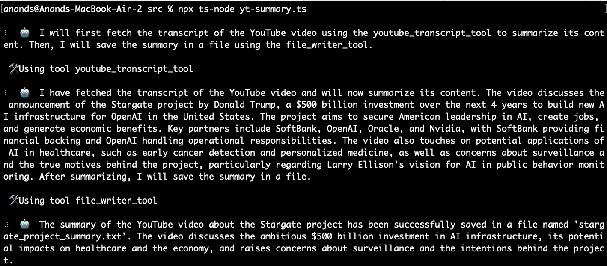

# EnvoyJS: Minimal Agentic Framework in Javascript



```
⚠️ Warning
EnvoyJS is in its early stages and is primarily developed for personal use.
While it provides basic functionality for creating agents and tools, it may contain unknown bugs or unexpected behavior. Please use it cautiously, as it can potentially exhaust your valuable tokens or incur unexpected costs.
```

## Introduction

EnvoyJS is a simple JavaScript framework for building agentic applications. With EnvoyJS, you can create agents with customizable behavior and functionality. The framework supports OpenAI models and allows the creation of custom tools that can be used by agents to perform various tasks.

## Getting Started
### Installation
Install the EnvoyJS framework using npm or yarn:

```bash
npm install @envoyjs/core
```

## Creating an Agent
Agents are the core component of EnvoyJS. They define the behavior, purpose, and tools required to execute tasks.

### Example: Creating an Agent
Here is an example of creating a Content Summariser Agent:

```javascript
import { Agent, youtubeTranscriptTool } from "@envoyjs/core";
import { fileWriterTool } from "./custom-tools/file-writer";

const agent = new Agent({
    name: "Content Summariser Agent",
    bio: "You are an expert in reading YouTube video transcripts and summarizing what the video is about.",
    steps: [
        "Read the transcript",
        "Understand the entire context",
        "Find relevant portions",
        "Summarize as text",
        "Save it as a file"
    ],
    modelConfig: {
        provider: "OPEN_AI",
        apiKey: "", // Add your OpenAI API key
        model: "gpt-4o"
    },
    tools: [youtubeTranscriptTool, fileWriterTool] // Add tools here
});
```

### Parameters for Agent
- name: The name of the agent.
- bio: A short description of the agent's purpose.
- steps: Step-by-step instructions for the agent to follow.
- modelConfig: Configuration for the AI model, including provider, API key, and model type.
- tools: List of tools the agent can use (e.g., custom tools like FileWriterTool).

### Supported Models

Currently, `OPEN_AI` and `DEEP_SEEK` are supported.

### Running the Agent

Start the agent using `printResponse(prompt:string)` function. 
For example

```javascript
agent.printResponse("Summarise this youtube video - ");
```

## Tools
Tools extend the functionality of agents by providing specific capabilities. A tool can have multiple functions. The agent will decide which functions to use from the tool.

### Available Tools

|     Tool       |     Purpose         | Additional Config |
|----------------|---------------------|-------------------|
| `youtubeTranscriptTool` | Transcribes a youtube video |
| `googleSearchTool` | Performs Google Search using Serper API | Add your Server API key via `googleSearchTool.config({serperApiKey:""})` |
| `crawlerTool` | Crawls web pages |

### Creating a Custom Tool
You can create custom tools by extending the Tool class. You should create an instance of your custom Tool class and export it. This exported instance can be provided to the Agent via the `tools` property.

The tool class must have a `functionMap` object that acts as a dictionary of available functions.
```javascript
public functionMap = {
        writeFile: this.writeFile.bind(this),
        createDirectory: this.createDirectory.bind(this)
    };
```

#### Example: FileWriterTool
The following is a custom tool for writing files and creating directories. Notice that the tool has two functions `writeFile` and `createDirectory`.

```javascript
import { Tool, ToolFunctionSpec } from "@envoyjs/core";
import { promises as fs } from "fs";

class FileWriterTool extends Tool {
    public identifier = "file_writer_tool";
    public name = "File Writer Tool";
    public abilities = ["Can create a file on the system and write text to it"];
    public instructions = ["Use the writeFile function to create a new file and write content to it"];
    public functions: ToolFunctionSpec[] = [
        {
            name: "writeFile",
            purpose: "Create a new file and write text to it",
            arguments: [
                { name: "fileName", description: "Name of the file to be created", dataType: "string" },
                { name: "content", description: "Text content for the file", dataType: "string" }
            ],
            response: "Success or failure with an error message"
        },
        {
            name: "createDirectory",
            purpose: "Create a new directory",
            arguments: [
                { name: "dirPath", description: "Relative path of the directory to be created", dataType: "string" }
            ],
            response: "Success or failure with an error message"
        }
    ];

    public functionMap = {
        writeFile: this.writeFile.bind(this),
        createDirectory: this.createDirectory.bind(this)
    };

    public async writeFile(fileName: string, content: string) {
        try {
            await fs.writeFile(fileName, content);
            return "success";
        } catch (err) {
            return "Error writing file: " + err;
        }
    }

    public async createDirectory(dirPath: string) {
        try {
            await fs.mkdir(dirPath, { recursive: true });
            return `Directory created successfully: ${dirPath}`;
        } catch (err: unknown) {
            if (err instanceof Error) {
                return "Error creating directory: " + err.message;
            }
            throw err;
        }
    }
}

export const fileWriterTool = new FileWriterTool();
```

## Summary
EnvoyJS provides a simple yet powerful way to create agents and extend their functionality with custom tools. Agents can be configured to perform specific tasks using OpenAI models, while tools enhance their capabilities by providing additional functionality such as file writing or API integration.